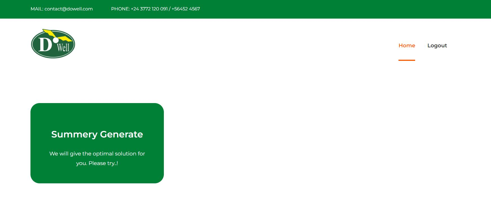
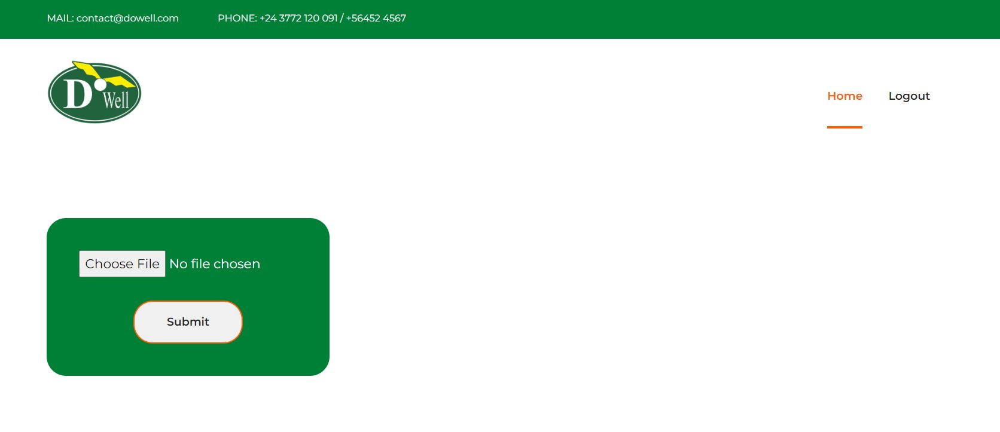
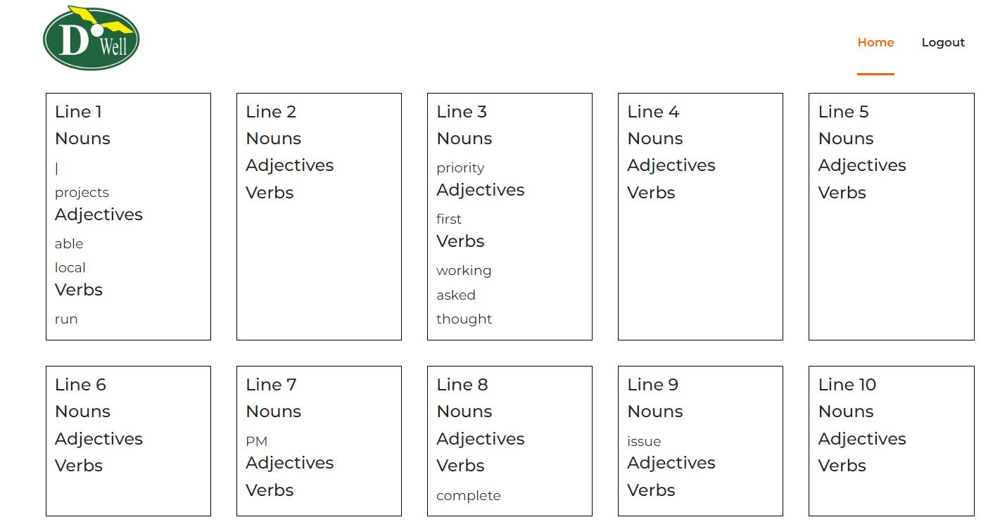

# DoWell Message Analysis Project From DoWell UX Living Lab

Welcome to the DoWell Message Analysis Project! The Message Analysis Project is a tool that allows users to extract text from images or from any paragraph and analyze it to identify nouns, verbs, and adjectives. It also provides an API for text analysis, making it easy to integrate into other applications.

## Features

- Extract text from images using Optical Character Recognition (OCR).
- Analyze extracted text to identify nouns, verbs, and adjectives.
- User-friendly web interface for image uploads and analysis.
- API endpoint for text analysis.

## Getting Started

To get started with this project, you have two options:

1. **Web Interface:**

   - Visit our web application [here](https://100093.pythonanywhere.com/) to upload an image or write/paste paragraph and analyze the text.
   
2. **API Usage:**

   - To use the API, you need an API key. Please contact us at [https://100093.pythonanywhere.com/](https://100093.pythonanywhere.com/) to obtain your API key.
   - Make a POST request to with your API key and the text you want to analyze.
   - You will receive a JSON response with information about the nouns, verbs, and adjectives in the text.


# Steps to use DoWell Message Analysis Web App

## Step 1:
To analyze your text, please begin by logging into Message Analysis page. You can access the login page by clicking on the following link: [Message Analysis Login](https://livinglab100114.pythonanywhere.com/) <br>
Once you have successfully logged in, you will see this page. From there, you can see an option which is "summery generator".


<br>
<br>
## Step 2:
After clicking "summery generator" you'll redirect another page, where you just need to upload your image (text related image).

<br>
## Step 3:
By uploading "image" you need to press the submit button and after that you will redirect result page.

<br>

# API Detailed Documentation
=============================================================================
## Fetch Data Using the API

### URL: https://livinglab100114.pythonanywhere.com/API/noun_&_verb/v1/API
### Method: POST

This API enables you to retrieve data.

#### Request Data / API Payload

```json
{
    "api-key": "your-dowell-api-key",
    "data_sentence": "your-data"
}
```

#### Parameters

- `api-key` (required): Your Dowell API key.
- `data_sentence`: Your given text or sentences.

#### Example of Fetching Data in Python

```python
import requests
import json

url = "https://livinglab100114.pythonanywhere.com/API/noun_&_verb/v1/API"

data = {
    "api-key": "your-dowell-api-key",
    "data_sentence": "your-data"

}

response = requests.post(url, json=data)
print(response.text)
```

#### Response:

- For success: `{"data": "[]"}` (an empty array in this example)
- For error: `{"message": "Invalid Api key"}`
- 

### Response Codes

- For success: HTTP 200 OK with a JSON response containing a success message.
- For errors: HTTP status codes such as 404 Not Found or 400 Bad Request with an error message.

**Note:** Ensure you replace placeholders such as `"your-dowell-api-key"` and other specific details with actual values in your requests.

```
Thank you for choosing Dowell API. We look forward to helping you with your data operations.Please ensure you have the necessary API key and valid data to perform these operations successfully.
